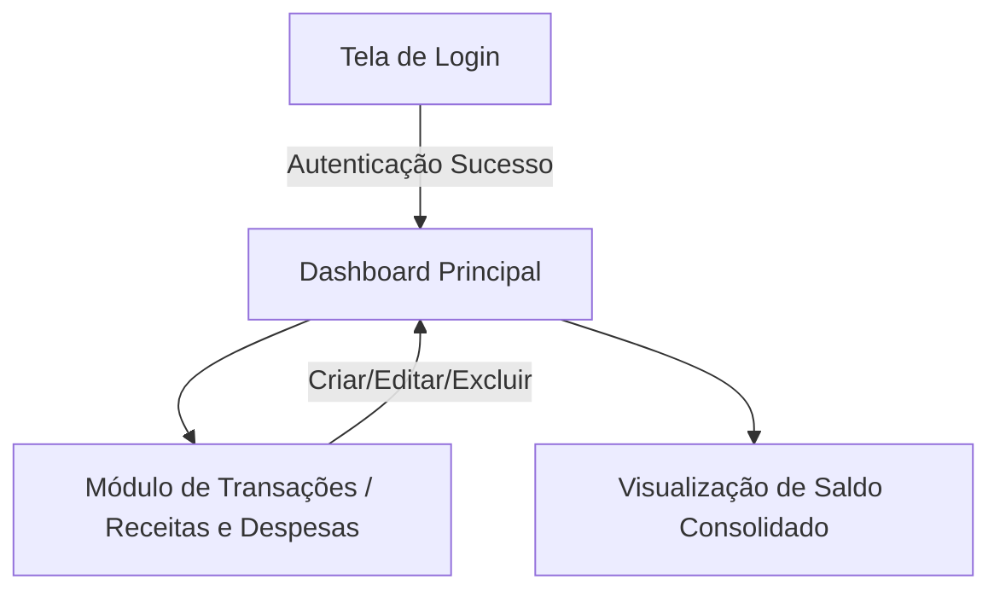

# Visão Geral do Sistema: Gestão Financeira (Love & Money)

## 1. Informações Globais
* **Nome da Aplicação**: Love & Money - Gestão Financeira
* **URL Base**: https://love-money-simple.lovable.app/
* **Arquitetura**: Single Page Application (SPA / React)
* **Ambiente de Testes**: Homologação / Staging

## 2. Perfis de Acesso e Autenticação
* **Perfis Disponíveis**:
  * `Usuário Autenticado`: Acesso total à gestão de receitas, despesas, cartões, categorias e dashboard financeiro.
* **Estratégia de Sessão**: Form Login / Authentication State
* **Credenciais de Teste Recomendadas**:
  * Perfil Usuário Autenticado: `mateusasfreitas@gmail.com` / `Pic@12345`

## 3. Módulos Principais e Rotas Macro
* **Autenticação**: `https://love-money-simple.lovable.app/` - Login e registro de usuários.
* **Dashboard / Painel**: `https://love-money-simple.lovable.app/` (após login) - Visualização de métricas consolidadas, saldos e gráficos.
* **Transações (Receitas e Despesas)**: `https://love-money-simple.lovable.app/` - Cadastro, edição, listagem e remoção de entradas (income) e saídas (expense).

## 4. Estrutura de Navegação Macro

## 5. Observações e Restrições Globais
* **Ambiente de Execução**: Staging público hospedado no Lovable Apps.
* **Navegadores Homologados**: Chromium / WebKit / Firefox (via Playwright).
