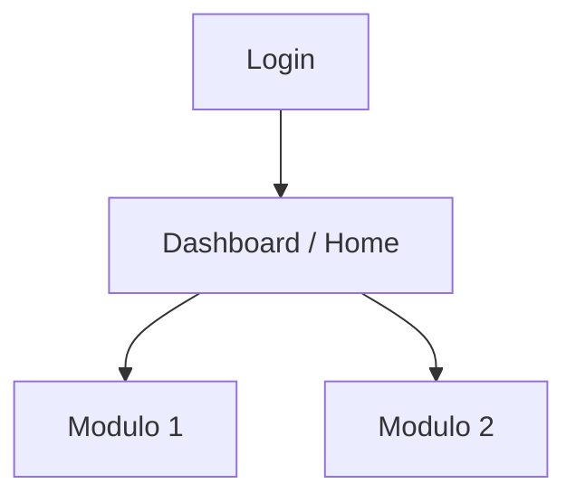

# Visao Geral do Sistema: [Nome do Sistema]

## 1. Informacoes Globais
* **Nome da Aplicacao**: [Nome do Sistema]
* **URL Base**: [URL Base / Homologacao / Dev]
* **Arquitetura**: [Ex: Single Page Application (React / Angular / Vue), SSR, Mobile Web]
* **Ambiente de Testes**: [Ex: Localhost / Staging / HMG]

## 2. Perfis de Acesso e Autenticacao
* **Perfis Disponiveis**:
  * `[Perfil 1]`: [Descricao e nivel de permissao]
  * `[Perfil 2]`: [Descricao e nivel de permissao]
* **Estrategia de Sessao**: [Ex: Cookie / LocalStorage JWT / Form Login]
* **Credenciais de Teste Recomendadas**:
  * Perfil [Perfil 1]: `[usuario]` / `[senha]`

## 3. Modulos Principais e Rotas Macro
* **[Nome do Modulo 1]**: `[rota/url]` - [Descricao resumida da finalidade]
* **[Nome do Modulo 2]**: `[rota/url]` - [Descricao resumida da finalidade]

## 4. Estrutura de Navegacao Macro

## 5. Observacoes e Restricoes Globais
* [Restricoes de browser, variaveis de ambiente especificas, dependencias de APIs externas, etc.]
