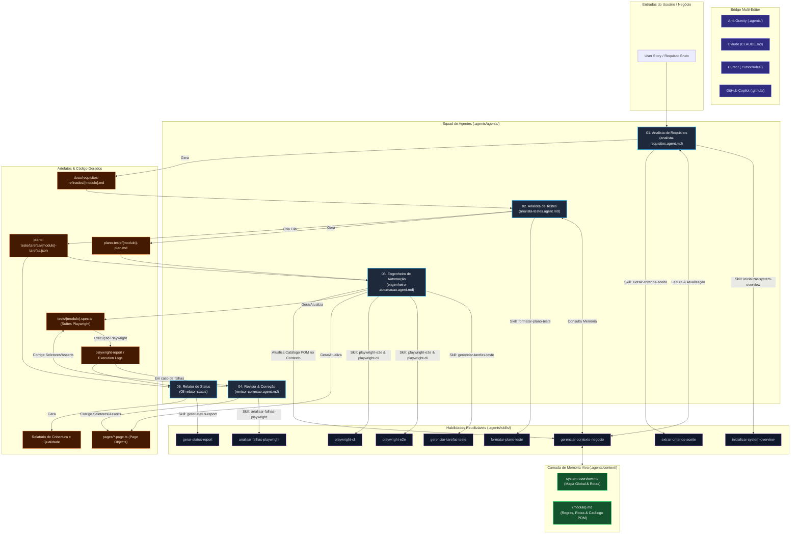

# Arquitetura do Squad de QA Agêntico & Skills

> **QA Multi-Agents Framework** - Estrutura de Agentes, Skills, Memória Contextual Persistente e Pontes Multi-IDE.

---

## 1. Visão Geral da Arquitetura

O **QA Multi-Agents Framework** segue o conceito de **Agentic Workspace com Living Knowledge Base (Memória Viva)**. A inteligência do squad é estruturada em três pilares fundamentais:

1. **Agentes (`.agents/agents/`)**: Personas especializadas com objetivos de negócio, autonomia de decisão e papéis definidos no ciclo de testes.
2. **Skills Reutilizáveis (`.agents/skills/`)**: Padrões técnicos, templates estruturais, utilitários e comandos de execução consumidos pelos agentes.
3. **Memória Contextual Persistente (`.agents/context/`)**: Camada de conhecimento funcional viva que registra a visão global do sistema (`system-overview.md`), rotas e o catálogo de Page Objects por módulo.

---

## 2. Diagrama Arquitetural & Fluxo de Trabalho (Mermaid)



---

## 3. Detalhamento do Squad de Agentes

| Agente | Arquivo de Configuração | Responsabilidade Principal | Skills Utilizadas | Entrada | Saída Esperada |
| :--- | :--- | :--- | :--- | :--- | :--- |
| **01. Analista de Requisitos** | `.agents/agents/analista-requisitos.agent.md` | Refinar histórias de usuário, validar regras de negócio e atualizar a memória funcional | `inicializar-system-overview`, `extrair-criterios-aceite`, `gerenciar-contexto-negocio` | User Story / Requisito bruto | `docs/requisitos-refinados/{modulo}.md` |
| **02. Analista de Testes** | `.agents/agents/analista-testes.agent.md` | Criar planos de teste detalhados em passos numerados, matriz de rastreabilidade e arquivo JSON de tarefas | `formatar-plano-teste`, `gerenciar-contexto-negocio` | Requisitos Refinados + `.agents/context/` | `plano-teste/{modulo}-plan.md` e `{modulo}-tarefas.json` |
| **03. Engenheiro de Automação** | `.agents/agents/engenheiro-automacao.agent.md` | Desenvolver classes Page Object (POM), suítes de teste Playwright executáveis e atualizar status | `playwright-e2e`, `gerenciar-tarefas-teste`, `gerenciar-contexto-negocio`, `playwright-cli` | Plano de Testes + Fila JSON | `pages/*.page.ts`, `tests/{modulo}.spec.ts` e `{modulo}-tarefas.json` atualizado |
| **04. Revisor & Correção** | `.agents/agents/revisor-correcao.agent.md` | Diagnosticar falhas de execução, atualizar seletores quebrados, ajustar timeouts e restaurar testes falhos sob demanda | `analisar-falhas-playwright`, `playwright-cli`, `playwright-e2e`, `gerenciar-contexto-negocio`, `gerenciar-tarefas-teste` | Logs, Stacktraces, Specs, Keywords ("corrija o teste X") | Correção em `pages/`, `tests/`, `.agents/context/` e tarefas JSON |
| **05. Relator de Status** | `05-relator-status` | Consolidar relatórios executivos de qualidade, cobertura de requisitos e lista de bugs | `gerar-status-report` | Logs do Playwright + Tarefas JSON | Relatório executivo de status |

---

## 4. Matriz de Skills Reutilizáveis

- **`inicializar-system-overview`**: Skill de onboarding interativo para gerar `.agents/context/system-overview.md` com a URL base e o fluxo global do sistema.
- **`gerenciar-contexto-negocio`**: Protocolo de leitura, criação e atualização contínua dos arquivos de memória em `.agents/context/{modulo}.md`.
- **`extrair-criterios-aceite`**: Checklist e padrão para estruturação de critérios de aceite no padrão INVEST.
- **`formatar-plano-teste`**: Template de plano de testes com passos numerados sequenciais, matriz de rastreabilidade e schema JSON.
- **`playwright-e2e`**: Padrões de escrita do Playwright com TypeScript, Page Object Model (POM), seletores acessíveis e web-first assertions.
- **`gerenciar-tarefas-teste`**: Leitura de pendências e atualização do status de automação (`AUTOMATIZADO`/`BLOQUEADO`) no arquivo JSON de tarefas.
- **`playwright-cli`**: Habilidade de navegação, captura de snapshots, gravação de passos e inspeção DOM em tempo real via Playwright MCP Server.
- **`analisar-falhas-playwright`**: Árvore de decisão para diagnóstico de falhas em testes automatizados.
- **`gerar-status-report`**: Consolidação de métricas e relatório de qualidade.
- **`skill-creator`**: Utilitário interno para criação, validação e empacotamento de novas skills.

---

## 5. Estrutura de Pastas do Projeto

```text
qa-muti-agents-framework/
├── .agents/
│   ├── agents/            # Personas e instruções dos 5 Agentes de QA
│   ├── skills/            # Habilidades técnicas reutilizáveis
│   └── context/           # Camada de Memória Viva (system-overview.md e {modulo}.md)
├── docs/
│   ├── requisitos-refinados/  # Requisitos extraídos pelo Analista de Requisitos
│   ├── project_spec.md        # Especificação original do template
│   └── arquitetura-squad.md   # Esta documentação da arquitetura
├── plano-teste/
│   ├── {modulo}-plan.md       # Planos de teste com passos numerados e matriz
│   └── tarefas/
│       └── {modulo}-tarefas.json  # Controle de status da automação
├── pages/                 # Page Objects gerados e mantidos pela automação
├── tests/                 # Specs automatizadas do Playwright (.spec.ts)
├── CLAUDE.md              # Ponte de integração para Claude
├── .cursor/rules/         # Ponte de integração para Cursor
└── .github/               # Ponte de integração para GitHub Copilot
```
